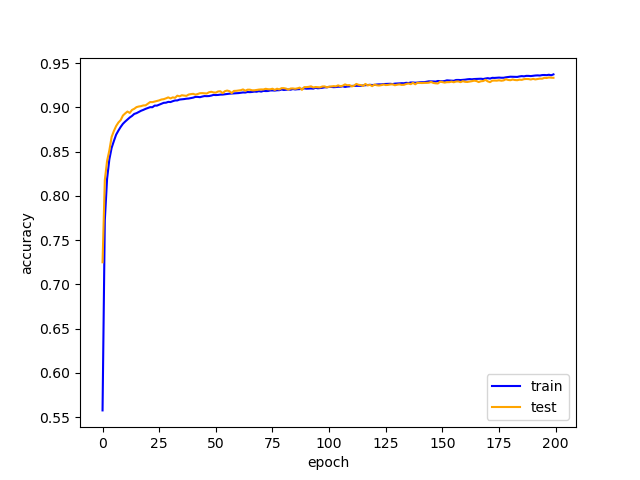
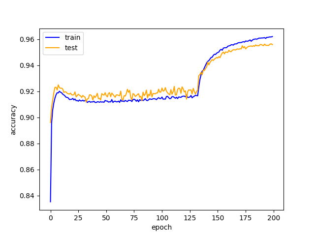
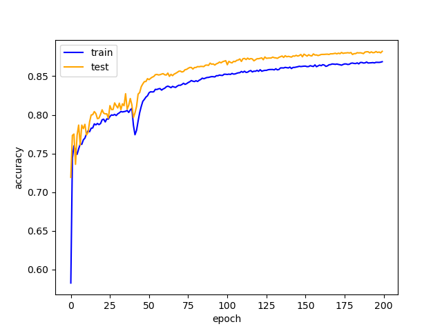
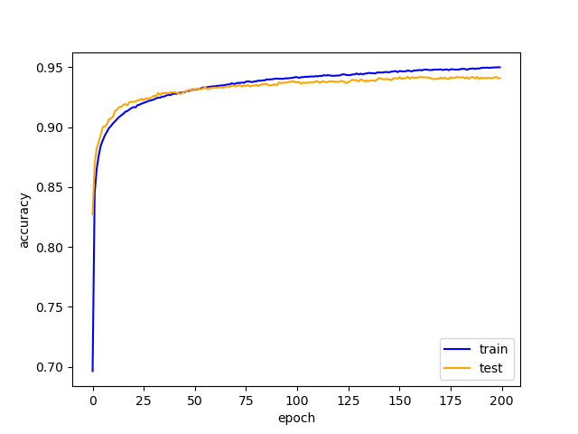

# QNN Framework

## About This Project
In this project, I created a deep learning framework that can do quantization with little implementation. This framework has an automatic differentiation mechanism, just like today's major frameworks. This framework also has the required components for easy programming such as dataloader, optimizer and fully connected layers.

In today's typical deep learning frameworks, low bit neural networks cannot be implement automatically. To quantize neural networks, we need to embed a custom layer to compare the reduction in accuracy for each bit size. However, with our framework, comparison between low bits can be done more easily. We hope that this will accelerate the research of neural networks with low bit sizes.

## Slide
This work was presented at a machine learning lab at the University of Tokyo. The presentation materials can be found at the following link. The presentation was made by Japanese, but I post the english version here.
https://docs.google.com/presentation/d/1r5oDGx8sBrcrgIFj2aoRqbAOuHBDsA3OB5Aea4awyog/edit?usp=sharing

## Tutorial
Tutorial includes three files.

mnist.py: Code for normal neural networks.

qmnist.py: Code for quantized neural networks.

bmnist.py: Code for binary neural networks.

As you can see in the tutorial, quantized layer is implemented as "Q_Linear" in /myframework/layers.py. You can use this layer to implement your own quantized neural networks.

## Results Overview
Here is a brief summary of the toy program in tutorial.

Results of normal neural network (32 bit).

Results of quantized neural network (4 bit).

Results of quantized neural network (2 bit).

Results of binary neural network (1 bit).

As you can see from the result, the accuracy is maintained to some extent even after quantization. It is also interesting that even very low neural network maintains accuracy. However, when the number of bits is reduced, the network tends to overfit a little. In addition, we found that 1-bit keeps better results than 2-bit. This is very strange, but the value of 2 bit represents (-2,-1,0,1), and this asymmetry may have caused accuracy degradation.

## Reference
1. Choi, Jungwook, et al. "Accurate and efficient 2-bit quantized neural networks." Proceedings of the 2nd SysML Conference. Vol. 2019. 2019.
2. Hubara, Itay, et al. "Quantized neural networks: Training neural networks with low precision weights and activations." The Journal of Machine Learning Research 18.1 (2017): 6869-6898.
3. Miyashita, Daisuke, Edward H. Lee, and Boris Murmann. "Convolutional neural networks using logarithmic data representation." arXiv preprint arXiv:1603.01025 (2016).
4. ゼロから作るDeep Learning
https://www.oreilly.co.jp/books/9784873119069/
